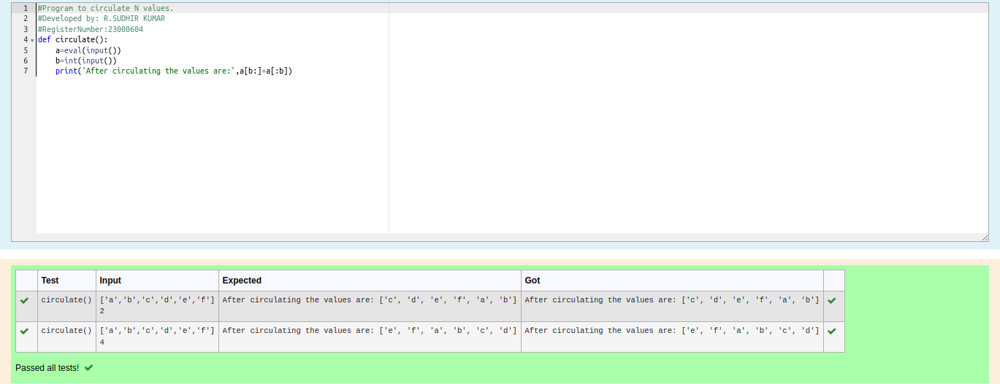

# Circulate-the-values-of-N-variables
## Aim:
To write a python program to circulate the n variables using function concept
## Equipment’s required:
PC
Anaconda - Python 3.7
## Algorithm: 
### Step 1: 
create a function
### Step 2:
get inputs
### Step 3: 
Using the slicing concept rotate the list
### Step 4:
print the output 
###
## Program:
```python
#Program to circulate N values.
#Developed by: R.SUDHIR KUMAR
#RegisterNumber:23000604
def circulate():
    a=eval(input())
    b=int(input())
    print('After circulating the values are:',a[b:]+a[:b])
```

## Output:


## Result:
Thus the Circulate-the-values-of-N-variables are successfully executed